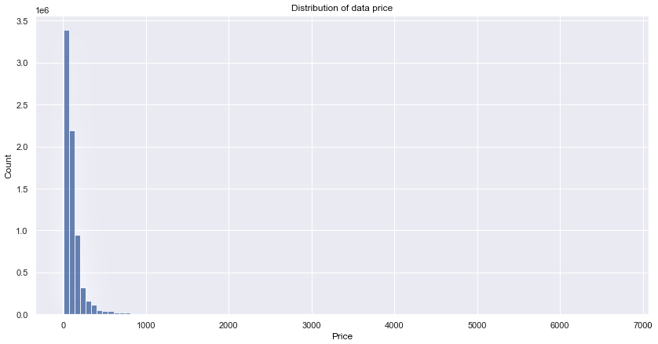

# Introduction

This is a Pacmann Academy SQL & Data Wrangling project involving visual examination of datasets, problem identification, and problem solving. 
First, introduce the Olist company and the datasets. Olist is a Brazilian e-commerce company that provides solutions for online sales and e-commerce services. It offers a variety of technologies, tools, and connectors to help streamline and speed online business processes. Finally, provide remedies to the challenges and a benefit evaluation. The Python programming language is utilized in this project for data analysis and graphics.

## Objectives
- Number of Order per Each Product Category: Identifying the number of orders received by Olist in each product category helps in understanding the popularity of a particular product category.
- The most item of product categories: Analyze the top product categories to understand the extent to which these products contribute to Olist's revenue and popularity.
- Top 3 for Each Product Category Name by Product Category: Displays the top three products in each product category to provide insight into the most popular products in each category.
- Top 10 Customer State Capacity: Identifying the ten states with the largest customer capacity helped Olist identify the most potential regions.
- Revenue for Each State: Analyzing the revenue received by Olist from each state, helps in understanding the revenue contribution of each region.
- Monthly Revenue: Identify Olist's monthly revenue trends to assist in financial planning and business growth.
- Total Revenue per Each Product Category: Calculated the total revenue earned by each product category to estimate the relative contribution of each category.
- The Relationship between the Price of the Product and the Payment Value: Analyze the relationship between product price and payment value to understand if any correlations or trends can be identified.
- The Relationship between Product Volume and the Price: Analyze the relationship between product volume and price to evaluate whether product volume affects price.
- Average Price over Time by Product Category: Understand the average change in product prices over time within each product category.
- Payment Type Distribution: Display the distribution of payment types used by Olist customers to assist in better payment strategies.
- Payment Installment: Analyze payments made in installments to identify term payment patterns.

## Project Stages
1. Dataset
    - Accessing dataset
    - Load dataset
    - Create dataframe
2. Exploration and Processing
    - NaN identification
    - Outlier identification
    - Identify inconsistent format
    - Identify duplicate data
    - Other checks required
3. Explorating Data and Analysis

### Let's start by following the steps above

1. Dataset
  
      
      # matplotlib and seaborn for plotting
      import matplotlib.pyplot as plt
      import seaborn as sns
      from matplotlib.dates import MonthLocator, YearLocator
      
      import warnings
      warnings.filterwarnings("ignore")
      ```
    - Load Dataset
      ```
      # Create function to load dataset
  
      def get_result(query): # Create the get_result function
          dbfile = 'olist.db' # Create file path
          connection = sqlite3.connect(dbfile) # Accessing the dbfile
          cursor = connection.cursor() # Create a cursor object to execute SQL commands on a database
          cursor.execute(query) # Executing SQL commands
          data = cursor.fetchall() # Retrieve the result of SQL commands
          cursor.close() # Close the cursor
          connection.close() # Close connection
          return(data) # Return to the SQL command result
      ```
      - View the names of tables and columns in the dataset.
        ```
        # Define SQL commands to view tables in the olist database
        query_get_tables = "SELECT name FROM sqlite_master WHERE type='table';"
        
        # Run SQL command using get_result function
        tables = get_result(query_get_tables) # View tables in the dbfile
        
        # Show table names
        for table in tables:
          table_name = table[0]
          print(f'Table Name : {table_name}')
        
        # Define the SQL command to get the column structure of the table
        query_get_column = f'PRAGMA table_info({table_name});'
        
        # Run SQL command using get_result function
        columns = get_result(query_get_column)
        
        # Display the names of the columns in the table
        for column in columns:
          column_name = column[1]
          print(f' Column    : {column_name}')
        ```
      
        ![table-name]

    - Create Dataframe
      ```
      # Function for creating a dataframe
        def create_df(data, columns):
        process_data  = pd.DataFrame(data=data, columns=columns).drop('index', axis=1)
        
        # Reset column index
        process_data = process_data.reset_index(drop=True)
        
        # Combine multiple index levels to create a single column index
        process_data.columns = [''.join(col).strip() for col in process_data.columns.values]
        
        return process_data
      ```
        - Create columns for each tables
          ```
          # Creates column variables for each table
    
          # Customer Column
          olist_customer_column = ['index','customer_id','customer_unique_id','customer_zip_code_prefix','customer_city','customer_state']
          
          # Order Column
          olist_order_column = ['index','order_id','customer_id','order_status','order_purchase_timestamp','order_approved_at',
                                'order_delivered_carrier_date','order_delivered_customer_date','order_estimated_delivery_date']
          
          # Order Review Column
          olist_order_reviews_column = ['index','review_id','order_id','review_score','review_comment_title','review_comment_message',
                                        'review_creation_date','review_answer_timestamp']
          
          # Order Payment Column
          olist_order_payments_column = ['index','order_id','payment_sequential','payment_type','payment_installments','payment_value']
          
          # Order Item Column
          olist_order_items_column = ['index','order_id','order_item_id','product_id','seller_id','shipping_limit_date','price','freight_value']
          
          # Product Column
          olist_products_column = ['index','product_id','product_category_name','product_name_lenght','product_description_lenght',
                                   'product_photos_qty','product_weight_g','product_length_cm','product_height_cm','product_width_cm']
          
          # Seller Column
          olist_sellers_column = ['index','seller_id','seller_zip_code_prefix','seller_city','seller_state']
          
          # Geolocation Column
          olist_geolocation_column = ['index','geolocation_zip_code_prefix','geolocation_lat','geolocation_lng',
                                      'geolocation_city','geolocation_state']
          
          # Product Category Column
          olist_product_category_column = ['index','product_category_name','product_category_name_english']
          ```
        - Retrieve all dataset
          ```
          # Create df Customer
          olist_customer = create_df(get_result('SELECT * FROM olist_order_customer_dataset'),olist_customer_column)
          
          # Create df Order
          olist_order = create_df(get_result('SELECT * FROM olist_order_dataset'),olist_order_column)
          
          # Create df Order Review
          olist_order_reviews = create_df(get_result('SELECT * FROM olist_order_reviews_dataset'),olist_order_reviews_column)
          
          # Create df Order Paayment
          olist_order_payment = create_df(get_result('SELECT * FROM olist_order_payments_dataset'),olist_order_payments_column)
          
          # Create df Order Item
          olist_order_items = create_df(get_result('SELECT * FROM olist_order_items_dataset'),olist_order_items_column)
          
          # Create df Product
          olist_products = create_df(get_result('SELECT * FROM olist_products_dataset'),olist_products_column)
          
          # Create df Seller
          olist_sellers = create_df(get_result('SELECT * FROM olist_sellers_dataset'),olist_sellers_column)
          
          # Create df Geolocation
          olist_geolocation = create_df(get_result('SELECT * FROM olist_geolocation_dataset'),olist_geolocation_column)
          
          # Create df Product Category
          olist_product_category = create_df(get_result('SELECT * FROM product_category_name_translation'),olist_product_category_column)
          ```
        - Merge the necessary tables
          ```
          # Merge the necessary tables
          df_olist = pd.merge(olist_customer, olist_order, on='customer_id', how='inner')
          df_olist = df_olist.merge(olist_order_payment, on='order_id', how="inner")
          df_olist = df_olist.merge(olist_order_items, on='order_id', how="inner")
          df_olist = df_olist.merge(olist_products, on='product_id', how="inner")
          df_olist = df_olist.merge(olist_product_category, on='product_category_name', how="inner")
          ```
        - Classify product names into multiple product categories
          ```
          # Show unique value at product_category_name_english column
          column_product_categories = df_olist['product_category_name_english'].unique()
          print(column_product_categories)
          ```

          ```
          # Create a product category classification function
          def classify_product(x):
              categories = {
                  'Beauty & Health': ['health_beauty','perfumery','diapers_and_hygiene'],
                  'Book & Stationary': ['stationery','books_general_interest','books_imported','books_technical'],
                  'Electronics': ['computers_accessories','auto','air_conditioning','telephony','watches_gifts','consoles_games',
                                  'electronics','small_appliances','small_appliances_home_oven_and_coffee','signaling_and_security',
                                  'musical_instruments','fixed_telephony','tablets_printing_image','computers','audio','security_and_services'],
                  'Entertainment': ['sports_leisure','toys','art','music','dvds_blu_ray','christmas_supplies','party_supplies','cine_photo',
                                  'cds_dvds_musicals','arts_and_craftmanship'],
                  'Fashion': ['baby','fashio_female_clothing','cool_stuff','fashion_bags_accessories','fashion_male_clothing','fashion_shoes',
                              'fashion_underwear_beach','fashion_sport','fashion_childrens_clothes'],
                  'Food & Drinks': ['food_drink','drinks','food'],
                  'Furniture': ['office_furniture','home_confort','furniture_decor','bed_bath_table','kitchen_dining_laundry_garden_furniture',
                              'home_construction','furniture_living_room','furniture_bedroom','furniture_mattress_and_upholstery','home_comfort_2'],
                  'Home & Garden': ['housewares','garden_tools','pet_shop','construction_tools_lights','luggage_accessories','home_appliances_2',
                                  'home_appliances','market_place','costruction_tools_garden','la_cuisine','flowers'],
                  'Industry & Construction': ['costruction_tools_tools','construction_tools_construction','industry_commerce_and_business',
                                              'construction_tools_safety','agro_industry_and_commerce']
                              }
              for category, keywords in categories.items():
                  if x in keywords:
                      return category
              return None
          
          df_olist['product_category'] = df_olist['product_category_name_english'].apply(classify_product)
          ```
        - Drop unrelevan data
          ```
          # Removing unnecessary columns
          df_olist.drop(['customer_zip_code_prefix', 'customer_city', 'payment_sequential', 'order_item_id', 'shipping_limit_date',
                         'freight_value', 'product_name_lenght', 'product_description_lenght', 'product_photos_qty', 'product_weight_g','order_approved_at',
                         'order_delivered_carrier_date','order_delivered_customer_date','order_estimated_delivery_date','payment_sequential',
                         'product_category_name', 'order_status'],
                        axis=1, inplace=True)
          ```

2. Exploration and Processing
    - NaN Identification
      ```
      # Check for total NaN values

      nan_value = df_olist.isna().sum()[df_olist.isna().sum() > 0]
    
      # Construct a dataframe consists of NaN count and NaN percentage from the dataset
      nan_df_olist = pd.DataFrame ({'NaN_count ': nan_value,'NaN_percentage' : nan_value/len(df_olist)*100}).sort_values(by='NaN_percentage', ascending=False)
    
      # Show the data
      nan_df_olist
      ```

      ![NaN-Identification]

      ```
      # Generate a summary showing how many NaN values are in the 'product_length_cm', 'product_height_cm', and 'product_width_cm' columns 
      # for each product category 'product_category_name_english'
      nan_summary = pd.pivot_table(df_olist, index='product_category_name_english', 
                                 values=['product_length_cm', 'product_height_cm', 'product_width_cm'], 
                                 aggfunc=lambda x: x.isna().sum())
    
      # Filter rows with NaN values in columns 'product_length_cm', 'product_height_cm', and 'product_width_cm'
      # >0 is checks if the value in the 'product_length_cm','product_height_cm', and 'product_width_cm' column is greater than 0. 
      # It returns a Series boolean that will be True if the value is greater than 0 and False otherwise.
      filtered_rows = nan_summary.loc[(nan_summary['product_length_cm'] > 0) | 
                                    (nan_summary['product_height_cm'] > 0) | 
                                    (nan_summary['product_width_cm'] > 0)]

      filtered_rows
      ```
      ![NaN-output]

    - Calculate the mode from product category 'baby' only to fill the NaN values
      ```
      # Calculate the mode (most frequent value) for the columns 'product_length_cm', 'product_height_cm', and 'product_width_cm' 
      # for the product category 'baby' only
      baby_mode = df_olist.loc[df_olist['product_category_name_english'] == 'baby']
    
      # Find the most frequently occurring value in the 'product_length_cm' column
      product_length_mode = baby_mode['product_length_cm'].mode()[0]
    
      # Find the most frequent value in the 'product_height_cm' column
      product_height_mode = baby_mode['product_height_cm'].mode()[0]
    
      # Look for the most frequently occurring value in the 'product_width_cm' column
      product_width_mode = baby_mode['product_width_cm'].mode()[0]
    
      # Show each mode values
      print(f'Product length modus : {product_length_mode}')
      print(f'Product height modus : {product_height_mode}')
      print(f'Product width modus  : {product_width_mode}')
    
      # Fill 'product_length_cm' with mode value
      df_olist['product_length_cm'].fillna(product_length_mode, inplace=True)
        
      # Fill 'product_height_cm' mode value
      df_olist['product_height_cm'].fillna(product_height_mode, inplace=True)
    
      # Fill 'product_width_cm' with mode value
      df_olist['product_width_cm'].fillna(product_width_mode, inplace=True)
      ```
    - Create product volume column
      ```
      # Create Product Volume Column
      df_olist['product_volume_cm3'] = df_olist['product_length_cm'] * df_olist['product_height_cm'] * df_olist['product_width_cm']
        
      df_olist['product_volume_cm3'].head()
      ```

      ```
      # Drop columns length, heigth and width
      df_olist.drop(['product_length_cm','product_height_cm','product_width_cm'], axis=1, inplace=True)
    
      # Show dataframe
      df_olist.head()
      ```

    - Outlier Identify
      ```
      # Generate descriptive stastistic
      df_olist.describe()  
      ```
      ![df-describe]

      In the price column, it can be seen that the 75% data and the max data have a very large range. We can assume this is an outlier
      ```
      # Show distribution of data price

      plt.figure(figsize=(10, 7))
      sns.histplot(df_olist['price'], bins=100, palette='Set2')
      plt.title('Distribution of data price')
      plt.xlabel('Price')
      plt.show()
      ```
      

      > [!NOTE]
      > - _It can be seen that the scale of the x axis reaches 7000._
      > - _This happens because there is data whose value is close to 7000._
      > - _This can be validated by looking at the statistical description of the price column._

      ```
      # Show in boxlot graph

      plt.figure(figsize=(10,7))
      sns.boxplot(df_olist['price'])
      plt.title('Box Plot : Distribution of data price')
      plt.xlabel('Price')
      plt.show()
      ```
      
      
      ```
      # Generate descriptive stastistic at column 'price'
      df_olist['price'].describe()
      ```

      ```
      Output:
      count    7.416192e+06
      mean     1.209247e+02
      std      1.842164e+02
      min      8.500000e-01
      25%      3.990000e+01
      50%      7.490000e+01
      75%      1.349000e+02
      max      6.735000e+03
      Name: price, dtype: float64
      ```
      > [!NOTE]
      > - _It can be seen that the maximum value of the price column is 6735._
      > - _This number is very far compared to the Q3 value of 1349._
      > - _The data above Q3 has the potential to be an outlier._
      > - _Let's assume there are indeed outliers._
     
        - We will determine a data is an outlier, if its value is greater than Q3 + 1.5 IQR
          ```
          # Outliers Detection
          # Calculate the upper and lower limits
          #IQR
        
          q1 = df_olist['price'].quantile(0.25)
          q3 = df_olist['price'].quantile(0.75)
        
          iqr = q3 - q1
        
          upper = q3 + 1.5*iqr
          lower = q1 - 1.5*iqr
          ```

          ```
          # Filtering data without outliers
          df_olist = df_olist[df_olist['price'] < upper]
          ```

          > It can be seen that Q3 and the maximum value are not far apart

          ```
          # Show distribution of data price

          plt.figure(figsize=(10,7))
          sns.histplot(df_olist['price'], bins=100)
          plt.title('Distribution of data price')
          plt.xlabel('Price')
          plt.show()
          ```
          
          
      
        
     

     
      
        
