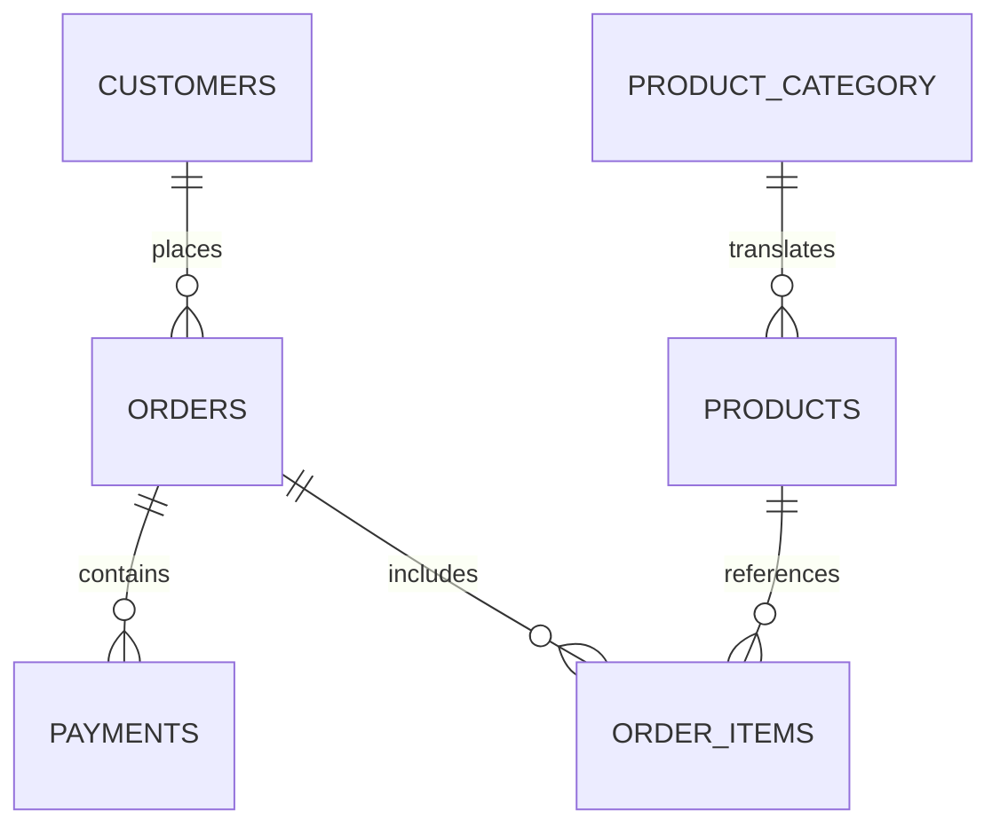

# 🇧🇷 Olist E-Commerce Relational Database Analytics Pipeline

An end-to-end analytical framework executed on the multi-table relational dataset of Olist—the largest e-commerce department store integrator in the Brazilian market. This project bridges raw relational database queries via SQL with comprehensive exploratory data analysis (EDA) in Python to address structural operational problems, map localized revenue distribution, and uncover user payment preferences.

## 🎯 Analytical & Business Dimensions Covered
* **Demand Mapping:** Evaluation of volume and order density across high-level product clusters.
* **Geographical Distribution:** Assessment of buyer capacities and gross revenue contribution by Brazilian state.
* **Macro Financial Trends:** Longitudinal analysis of monthly revenue volatility and invoice payment metrics.
* **Transactional Behavior:** Statistical exploration of the interaction between product physical volume, pricing nodes, and installment cycles.

---

# 🏗️ Relational Schema & Structural Engineering

```mermaid
erDiagram
    CUSTOMERS ||--o{ ORDERS : places
    ORDERS ||--o{ PAYMENTS : contains
    ORDERS ||--o{ ORDER_ITEMS : includes
    PRODUCTS ||--o{ ORDER_ITEMS : references
    PRODUCT_CATEGORY ||--o{ PRODUCTS : translates

```

### 1. High-Cardinality Feature Reduction

The original dataset contained over 70 highly specific product categories. To streamline executive dashboards and prevent visualization noise, a custom map-reduction function was implemented to group them into **9 cohesive macro-categories**:

* *Beauty & Health, Book & Stationery, Electronics, Entertainment, Fashion, Food & Drinks, Furniture, Home & Garden, and Industry & Construction.*

### 2. Advanced Data Wrangling & Imputation Integrity

* **Domain-Specific Mode Imputation:** Detected missing dimensions (`NaN`) within product metrics. Rather than utilizing a generic global median, the pipeline isolated the specific subset partition (`baby` category) to extract localized structural modes (`product_length_cm: 16.0`, `product_height_cm: 2.0`, `product_width_cm: 11.0`) for high-fidelity imputation.
* **Feature Integration:** Synthesized a compound physical feature—`product_volume_cm3`—by calculating the dimensional product of length, height, and width to measure shipping bulkiness effects on pricing models.
* **Statistical Outlier Mitigation:** Continuous variables such as `price` were audited using the Interquartile Range (IQR) method. Records exceeding the upper boundary ($Q3 + 1.5 \times IQR$) were isolated to ensure that baseline linear trends were not skewed by extreme, low-frequency anomalies.

---

# 📊 Exploratory Data Analysis (EDA) & Strategic Insights

### 1. Macro Volume and Category Performance

The consolidated **Electronics** macro-category captured the largest market share with **25,033 orders**, with *Computer Accessories* serving as the primary sub-category anchor (**6,740 orders**). Conversely, *Food & Drinks* retained the lowest transactional volume (**1,008 orders**).

### 2. Geographical Value Concentration

The state of **SP (São Paulo)** acts as Olist's core logistical stronghold, leading market density with **41,115 orders** and dominating national revenue generation. Conversely, northern territories like *RR (Roraima)* present minimal penetration points.

### 3. Revenue Chronology & Seasonal Spikes

Longitudinal evaluation revealed a monumental historic revenue peak in **November 2017**. This surge maps directly to high-volume Black Friday consumer activity, indicating a profound sensitivity to targeted seasonal promotional events.

### 4. Correlation Matrices: Price, Volume, and Payments

* **Price vs. Payment Value:** Shows a strong, clean positive correlation. Anomalies above the regression boundary indicate large-ticket orders handled under singular transactional batches.
* **Product Volume vs. Unit Price:** Tabular density demonstrates that the majority of Olist transactions reside in low-volume, highly affordable consumer package goods.

### 5. Transactional Credit & Installment Patterns

Credit cards serve as the dominant payment infrastructure across the platform. The structural analysis of payment behavioral trends shows that the highest cluster of consumers prefers a **1-month installment cycle**, maximizing immediate settlement over debt extension.

---

# 💡 Data-Driven Operational Recommendations

* **Logistical Reinforcement in Core Hubs:** Scale up distribution centers and local warehousing footprint within the **São Paulo (SP)** perimeter to protect delivery timelines where order volume is densest.
* **Inventory Allocation Tuning:** Prioritize supply chain stock and advertising spend toward high-margin **Electronics Sub-Categories** (*Computer Accessories*), while running cross-selling bundles to uplift low-velocity items like *Food & Drinks*.
* **Credit Promotion Alignment:** Given that credit cards with a single-month cycle dominate payment behaviors, look to collaborate with major Brazilian banking partners to offer cashback milestones on immediate credit settlements during high-season events (November Black Friday).

---

# 👤 Author

**[Wira Dhana Putra](https://wiradp.github.io/)**

* **Career Switcher** → Moving purposefully into Data Science, Machine Learning, and AI Engineering.
* **Data Ingestion Engine:** Executed natively using local `sqlite3` cursors wrapped inside reproducible `pandas` DataFrame factories.
* **Source Dataset:** Processed via Pacmann Academy LMS Ecosystem (Mirrored from the official Kaggle Olist Dataset Repository).

## 📄 License

This project is licensed under the MIT License - see the [LICENSE.md](LICENSE.md) file for details.

---
