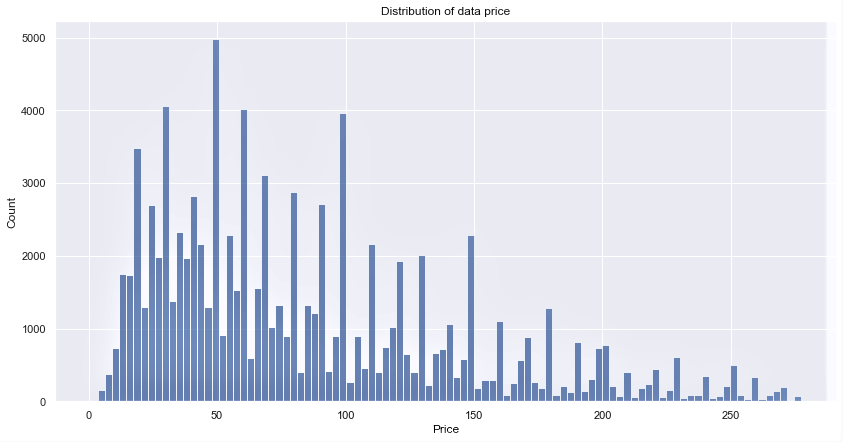

# Introduction

This is a Pacmann Academy SQL & Data Wrangling project involving visual examination of datasets, problem identification, and problem solving. 
First, introduce the Olist company and the datasets. Olist is a Brazilian e-commerce company that provides solutions for online sales and e-commerce services. It offers a variety of technologies, tools, and connectors to help streamline and speed online business processes. Finally, provide remedies to the challenges and a benefit evaluation. The Python programming language is utilized in this project for data analysis and graphics.

> :warning: Disclaimer: I'm using a dataset from Pacmann Academy's learning management system, but we may use the same dataset from [kaggle](https://www.kaggle.com/datasets/olistbr/brazilian-ecommerce/download?datasetVersionNumber=2)


## Objectives
- Number of Order per Each Product Category: Identifying the number of orders received by Olist in each product category helps in understanding the popularity of a particular product category.
- The most item of product categories: Analyze the top product categories to understand the extent to which these products contribute to Olist's revenue and popularity.
- Top 3 for Each Product Category Name by Product Category: Displays the top three products in each product category to provide insight into the most popular products in each category.
- Top 10 Customer State Capacity: Identifying the ten states with the largest customer capacity helped Olist identify the most potential regions.
- Revenue for Each State: Analyzing the revenue received by Olist from each state, helps in understanding the revenue contribution of each region.
- Monthly Revenue: Identify Olist's monthly revenue trends to assist in financial planning and business growth.
- Total Revenue per Each Product Category: Calculated the total revenue earned by each product category to estimate the relative contribution of each category.
- The Relationship between the Price of the Product and the Payment Value: Analyze the relationship between product price and payment value to understand if any correlations or trends can be identified.
- The Relationship between Product Volume and the Price: Analyze the relationship between product volume and price to evaluate whether product volume affects price.
- Average Price over Time by Product Category: Understand the average change in product prices over time within each product category.
- Payment Type Distribution: Display the distribution of payment types used by Olist customers to assist in better payment strategies.
- Payment Installment: Analyze payments made in installments to identify term payment patterns.

## Project Stages
1. Dataset
    - Accessing dataset
    - Load dataset
    - Create dataframe
2. Exploration and Processing
    - NaN identification
    - Outlier identification
    - Identify inconsistent format
    - Identify duplicate data
    - Other checks required
3. Explorating Data and Analysis

### Let's start by following the steps above

1. Dataset

    - Accessing dataset
      ```
      # sqlite3 used to integrate SQLite database with Python
      import sqlite3
      
      # pandas and numpy for data manipulation
      import pandas as pd
      import numpy as np
      pd.set_option('display.max_columns',100)  
      
      # matplotlib and seaborn for plotting
      import matplotlib.pyplot as plt
      import seaborn as sns
      from matplotlib.dates import MonthLocator, YearLocator
      
      import warnings
      warnings.filterwarnings("ignore")
      ```
    - Load Dataset
      ```
      # Create function to load dataset
  
      def get_result(query): # Create the get_result function
          dbfile = 'olist.db' # Create file path
          connection = sqlite3.connect(dbfile) # Accessing the dbfile
          cursor = connection.cursor() # Create a cursor object to execute SQL commands on a database
          cursor.execute(query) # Executing SQL commands
          data = cursor.fetchall() # Retrieve the result of SQL commands
          cursor.close() # Close the cursor
          connection.close() # Close connection
          return(data) # Return to the SQL command result
      ```
      - View the names of tables and columns in the dataset.
        ```
        # Define SQL commands to view tables in the olist database
        query_get_tables = "SELECT name FROM sqlite_master WHERE type='table';"
        
        # Run SQL command using get_result function
        tables = get_result(query_get_tables) # View tables in the dbfile
        
        # Show table names
        for table in tables:
          table_name = table[0]
          print(f'Table Name : {table_name}')
        
        # Define the SQL command to get the column structure of the table
        query_get_column = f'PRAGMA table_info({table_name});'
        
        # Run SQL command using get_result function
        columns = get_result(query_get_column)
        
        # Display the names of the columns in the table
        for column in columns:
          column_name = column[1]
          print(f' Column    : {column_name}')
        ```
      
        

    - Create Dataframe
      ```
      # Function for creating a dataframe
        def create_df(data, columns):
        process_data  = pd.DataFrame(data=data, columns=columns).drop('index', axis=1)
        
        # Reset column index
        process_data = process_data.reset_index(drop=True)
        
        # Combine multiple index levels to create a single column index
        process_data.columns = [''.join(col).strip() for col in process_data.columns.values]
        
        return process_data
      ```
        - Create columns for each tables
          ```
          # Creates column variables for each table
    
          # Customer Column
          olist_customer_column = ['index','customer_id','customer_unique_id','customer_zip_code_prefix','customer_city','customer_state']
          
          # Order Column
          olist_order_column = ['index','order_id','customer_id','order_status','order_purchase_timestamp','order_approved_at',
                                'order_delivered_carrier_date','order_delivered_customer_date','order_estimated_delivery_date']
          
          # Order Review Column
          olist_order_reviews_column = ['index','review_id','order_id','review_score','review_comment_title','review_comment_message',
                                        'review_creation_date','review_answer_timestamp']
          
          # Order Payment Column
          olist_order_payments_column = ['index','order_id','payment_sequential','payment_type','payment_installments','payment_value']
          
          # Order Item Column
          olist_order_items_column = ['index','order_id','order_item_id','product_id','seller_id','shipping_limit_date','price','freight_value']
          
          # Product Column
          olist_products_column = ['index','product_id','product_category_name','product_name_lenght','product_description_lenght',
                                   'product_photos_qty','product_weight_g','product_length_cm','product_height_cm','product_width_cm']
          
          # Seller Column
          olist_sellers_column = ['index','seller_id','seller_zip_code_prefix','seller_city','seller_state']
          
          # Geolocation Column
          olist_geolocation_column = ['index','geolocation_zip_code_prefix','geolocation_lat','geolocation_lng',
                                      'geolocation_city','geolocation_state']
          
          # Product Category Column
          olist_product_category_column = ['index','product_category_name','product_category_name_english']
          ```
        - Retrieve all dataset
          ```
          # Create df Customer
          olist_customer = create_df(get_result('SELECT * FROM olist_order_customer_dataset'),olist_customer_column)
          
          # Create df Order
          olist_order = create_df(get_result('SELECT * FROM olist_order_dataset'),olist_order_column)
          
          # Create df Order Review
          olist_order_reviews = create_df(get_result('SELECT * FROM olist_order_reviews_dataset'),olist_order_reviews_column)
          
          # Create df Order Paayment
          olist_order_payment = create_df(get_result('SELECT * FROM olist_order_payments_dataset'),olist_order_payments_column)
          
          # Create df Order Item
          olist_order_items = create_df(get_result('SELECT * FROM olist_order_items_dataset'),olist_order_items_column)
          
          # Create df Product
          olist_products = create_df(get_result('SELECT * FROM olist_products_dataset'),olist_products_column)
          
          # Create df Seller
          olist_sellers = create_df(get_result('SELECT * FROM olist_sellers_dataset'),olist_sellers_column)
          
          # Create df Geolocation
          olist_geolocation = create_df(get_result('SELECT * FROM olist_geolocation_dataset'),olist_geolocation_column)
          
          # Create df Product Category
          olist_product_category = create_df(get_result('SELECT * FROM product_category_name_translation'),olist_product_category_column)
          ```
        - Merge the necessary tables
          ```
          # Merge the necessary tables
          df_olist = pd.merge(olist_customer, olist_order, on='customer_id', how='inner')
          df_olist = df_olist.merge(olist_order_payment, on='order_id', how="inner")
          df_olist = df_olist.merge(olist_order_items, on='order_id', how="inner")
          df_olist = df_olist.merge(olist_products, on='product_id', how="inner")
          df_olist = df_olist.merge(olist_product_category, on='product_category_name', how="inner")
          ```
        - Classify product names into multiple product categories
          ```
          # Show unique value at product_category_name_english column
          column_product_categories = df_olist['product_category_name_english'].unique()
          print(column_product_categories)
          ```

          ```
          # Create a product category classification function
          def classify_product(x):
              categories = {
                  'Beauty & Health': ['health_beauty','perfumery','diapers_and_hygiene'],
                  'Book & Stationary': ['stationery','books_general_interest','books_imported','books_technical'],
                  'Electronics': ['computers_accessories','auto','air_conditioning','telephony','watches_gifts','consoles_games',
                                  'electronics','small_appliances','small_appliances_home_oven_and_coffee','signaling_and_security',
                                  'musical_instruments','fixed_telephony','tablets_printing_image','computers','audio','security_and_services'],
                  'Entertainment': ['sports_leisure','toys','art','music','dvds_blu_ray','christmas_supplies','party_supplies','cine_photo',
                                  'cds_dvds_musicals','arts_and_craftmanship'],
                  'Fashion': ['baby','fashio_female_clothing','cool_stuff','fashion_bags_accessories','fashion_male_clothing','fashion_shoes',
                              'fashion_underwear_beach','fashion_sport','fashion_childrens_clothes'],
                  'Food & Drinks': ['food_drink','drinks','food'],
                  'Furniture': ['office_furniture','home_confort','furniture_decor','bed_bath_table','kitchen_dining_laundry_garden_furniture',
                              'home_construction','furniture_living_room','furniture_bedroom','furniture_mattress_and_upholstery','home_comfort_2'],
                  'Home & Garden': ['housewares','garden_tools','pet_shop','construction_tools_lights','luggage_accessories','home_appliances_2',
                                  'home_appliances','market_place','costruction_tools_garden','la_cuisine','flowers'],
                  'Industry & Construction': ['costruction_tools_tools','construction_tools_construction','industry_commerce_and_business',
                                              'construction_tools_safety','agro_industry_and_commerce']
                              }
              for category, keywords in categories.items():
                  if x in keywords:
                      return category
              return None
          
          df_olist['product_category'] = df_olist['product_category_name_english'].apply(classify_product)
          ```
        - Drop unrelevan data
          ```
          # Removing unnecessary columns
          df_olist.drop(['customer_zip_code_prefix', 'customer_city', 'payment_sequential', 'order_item_id', 'shipping_limit_date',
                         'freight_value', 'product_name_lenght', 'product_description_lenght', 'product_photos_qty', 'product_weight_g','order_approved_at',
                         'order_delivered_carrier_date','order_delivered_customer_date','order_estimated_delivery_date','payment_sequential',
                         'product_category_name', 'order_status'],
                        axis=1, inplace=True)
          ```

2. Exploration and Processing
    - NaN Identification
      ```
      # Check for total NaN values

      nan_value = df_olist.isna().sum()[df_olist.isna().sum() > 0]
    
      # Construct a dataframe consists of NaN count and NaN percentage from the dataset
      nan_df_olist = pd.DataFrame ({'NaN_count ': nan_value,'NaN_percentage' : nan_value/len(df_olist)*100}).sort_values(by='NaN_percentage', ascending=False)
    
      # Show the data
      nan_df_olist
      ```

      

      ```
      # Generate a summary showing how many NaN values are in the 'product_length_cm', 'product_height_cm', and 'product_width_cm' columns 
      # for each product category 'product_category_name_english'
      nan_summary = pd.pivot_table(df_olist, index='product_category_name_english', 
                                 values=['product_length_cm', 'product_height_cm', 'product_width_cm'], 
                                 aggfunc=lambda x: x.isna().sum())
    
      # Filter rows with NaN values in columns 'product_length_cm', 'product_height_cm', and 'product_width_cm'
      # >0 is checks if the value in the 'product_length_cm','product_height_cm', and 'product_width_cm' column is greater than 0. 
      # It returns a Series boolean that will be True if the value is greater than 0 and False otherwise.
      filtered_rows = nan_summary.loc[(nan_summary['product_length_cm'] > 0) | 
                                    (nan_summary['product_height_cm'] > 0) | 
                                    (nan_summary['product_width_cm'] > 0)]

      filtered_rows
      ```
      

    - Calculate the mode from product category 'baby' only to fill the NaN values
      ```
      # Calculate the mode (most frequent value) for the columns 'product_length_cm', 'product_height_cm', and 'product_width_cm' 
      # for the product category 'baby' only
      baby_mode = df_olist.loc[df_olist['product_category_name_english'] == 'baby']
    
      # Find the most frequently occurring value in the 'product_length_cm' column
      product_length_mode = baby_mode['product_length_cm'].mode()[0]
    
      # Find the most frequent value in the 'product_height_cm' column
      product_height_mode = baby_mode['product_height_cm'].mode()[0]
    
      # Look for the most frequently occurring value in the 'product_width_cm' column
      product_width_mode = baby_mode['product_width_cm'].mode()[0]
    
      # Show each mode values
      print(f'Product length modus : {product_length_mode}')
      print(f'Product height modus : {product_height_mode}')
      print(f'Product width modus  : {product_width_mode}')
    
      # Fill 'product_length_cm' with mode value
      df_olist['product_length_cm'].fillna(product_length_mode, inplace=True)
        
      # Fill 'product_height_cm' mode value
      df_olist['product_height_cm'].fillna(product_height_mode, inplace=True)
    
      # Fill 'product_width_cm' with mode value
      df_olist['product_width_cm'].fillna(product_width_mode, inplace=True)
      ```
    - Create product volume column
      ```
      # Create Product Volume Column
      df_olist['product_volume_cm3'] = df_olist['product_length_cm'] * df_olist['product_height_cm'] * df_olist['product_width_cm']
        
      df_olist['product_volume_cm3'].head()
      ```

      ```
      # Drop columns length, heigth and width
      df_olist.drop(['product_length_cm','product_height_cm','product_width_cm'], axis=1, inplace=True)
    
      # Show dataframe
      df_olist.head()
      ```

    - Outlier Identify
      ```
      # Generate descriptive stastistic
      df_olist.describe()  
      ```
      

      In the price column, it can be seen that the 75% data and the max data have a very large range. We can assume this is an outlier
      ```
      # Show distribution of data price

      plt.figure(figsize=(10, 7))
      sns.set_theme(context='notebook', style='darkgrid', palette='deep', font='sans-serif', font_scale=1, color_codes=True, rc=None)
      sns.histplot(df_olist['price'], bins=100, palette='Set2')
      plt.title('Distribution of data price')
      plt.xlabel('Price')
      plt.show()
      ```
      

      > [!NOTE]
      > - _It can be seen that the scale of the x axis reaches 7000._
      > - _This happens because there is data whose value is close to 7000._
      > - _This can be validated by looking at the statistical description of the price column._

      ```
      # Show in boxlot graph

      plt.figure(figsize=(10,7))
      sns.boxplot(df_olist['price'])
      plt.title('Box Plot : Distribution of data price')
      plt.xlabel('Price')
      plt.show()
      ```
      
      
      ```
      # Generate descriptive stastistic at column 'price'
      df_olist['price'].describe()
      ```

      ```
      Output:
      count    7.416192e+06
      mean     1.209247e+02
      std      1.842164e+02
      min      8.500000e-01
      25%      3.990000e+01
      50%      7.490000e+01
      75%      1.349000e+02
      max      6.735000e+03
      Name: price, dtype: float64
      ```
      > [!NOTE]
      > - _It can be seen that the maximum value of the price column is 6735._
      > - _This number is very far compared to the Q3 value of 1349._
      > - _The data above Q3 has the potential to be an outlier._
      > - _Let's assume there are indeed outliers._
     
        - We will determine a data is an outlier, if its value is greater than Q3 + 1.5 IQR
          ```
          # Outliers Detection
          # Calculate the upper and lower limits
          #IQR
        
          q1 = df_olist['price'].quantile(0.25)
          q3 = df_olist['price'].quantile(0.75)
        
          iqr = q3 - q1
        
          upper = q3 + 1.5*iqr
          lower = q1 - 1.5*iqr
          ```

          ```
          # Filtering data without outliers
          df_olist = df_olist[df_olist['price'] < upper]
          ```

          > It can be seen that Q3 and the maximum value are not far apart

          ```
          # Show distribution of data price without outlier

          plt.figure(figsize=(10,7))
          sns.set_theme(context='notebook', style='darkgrid', palette='deep', font='sans-serif', font_scale=1, color_codes=True, rc=None)
          sns.histplot(df_olist['price'], bins=100)
          plt.title('Distribution of data price')
          plt.xlabel('Price')
          plt.show()
          ```
          
          > _Now the graphic looks positively skewed_
          
    - Identify inconsistent format
      ```
      # Identify inconsistent format in 'product_category_name_english'

      # Show the data
      df_olist['product_category_name_english'].unique()
      ```
  
      
      ```
      # Create a varialbe to replace inconsistent name
      replace_product_name = {'home_confort':'home_comfort', 'home_comfort_2':'home_comfort', 'home_appliances_2':'home_appliances'}

      # Replace it into dataframe
      df_olist['product_category_name_english'].replace(replace_product_name, inplace=True)
      ```

      ```
      # Generate unique value in column order_purchase_timestamp 
      df_olist['order_purchase_timestamp'].unique()
      ```
      ```
      Output:
      array(['2017-05-16 15:05:35', '2017-11-09 00:50:13',
       '2017-05-07 20:11:26', ..., '2017-05-17 17:44:34',
       '2017-01-26 11:09:00', '2017-09-17 16:51:43'], dtype=object)
      ```
      > [!NOTE]
      > - _From the information above, it can be seen that the column does not match the representation of the data type of the column_
      > - _order_purchase_timestamp: Indicates the purchase timestamp._
      > - _Because the value in this column begins with the year, we will change the yearfirst parameter in the to_datetime function._
      ```
      # Convert order_purchase_timestamp
      df_olist['order_purchase_timestamp'] = pd.to_datetime(df_olist['order_purchase_timestamp'], errors='coerce', yearfirst=True)
      ```
    - Identify duplicate data
      ```
      # Check duplicate data of dataframe
      df_olist[df_olist.duplicated(keep=False)]
      ```
      

      ```
      # Delete duplicate data
      df_olist = df_olist.drop_duplicates(keep='first').reset_index(drop=True)
      ```

3. Exploring Data & Analysis
   - Number of Order per Each Product Category
     ```
     # Visualize the data of product category with bar plots 

     plt.figure(figsize=(10,7))
     ax = sns.barplot(x=df_olist['product_category'].value_counts().values, y=df_olist['product_category'].value_counts().index, palette='Set2')
     plt.title('Number of order per each product category')
     max_values = df_olist.groupby('product_category')['product_category'].count().max()
     min_values = df_olist.groupby('product_category')['product_category'].count().min()
     for index, value in enumerate(df_olist['product_category'].value_counts().values):
        if value == max_values:
            ax.text(value, index, f'{value}', ha='right', va='center')
        if value == min_values:
            ax.text(value, index, f'{value}', ha='left', va='center')
     plt.show()
     ```
     
     > ***Electronics as the most ordered product category with 25033 orders and food & drinks as the least ordered product category with 1008 orders.***
   - The most item in product categories
     ```
     # Filter max value count in product category
     df_olist['product_category'].value_counts().idxmax()
     ```

     ```
     Output:
     'Electronics'
     ```

     ```
     # Show item of product categories in Electronics

     # Filter DataFrame for product_category equal to "Electronics"
     electronic_df = df_olist[df_olist['product_category'] == 'Electronics']
    
     # Count the number of occurrences of each product_category_name_english
     category_count = electronic_df['product_category_name_english'].value_counts().reset_index()
     category_count.columns = ['product_category_name_english', 'count']
    
     # Sort DataFrame descendingly by its number
     category_count = category_count.sort_values(by='count', ascending=False)
     max_category_count = category_count['count'].max()
    
     # Visualize the data with bar plots
     plt.figure(figsize=(12, 8))
     ax = sns.barplot(x='count', y='product_category_name_english', data=category_count, palette='Set2')
     plt.title('Product Categories in Electronics')
     plt.ylabel('Product Category Name ')
     highest_count_category = category_count[category_count['count'] == max_category_count]['product_category_name_english'].values[0]
     ax.text(max_category_count, 0, f'{max_category_count}', ha='right', va='center', fontsize=10)
     plt.show()
     ```
     
     > ***The most ordered electronic product category, totaling 6740, turned out to be computer accessories.***
     
   - Top 3 for Each Product Category Name by Product Category
     ```
     # Grouped the data based on 'product_category' and 'product_category_name_english', then counted the number.
     category_counts = df_olist.groupby(['product_category', 'product_category_name_english']).size().reset_index(name='count')
    
     # Filtering the top 3 product_category_name_english in each product_category
     top_categories = category_counts.groupby('product_category').apply(lambda x: x.nlargest(3, 'count')).reset_index(drop=True)
    
     # Visualize for each product_category with bar plot
     plt.figure(figsize=(12, 8))
     sns.barplot(data=top_categories, x='count', y='product_category_name_english', hue='product_category', palette='Set2')
     plt.xlabel('Count')
     plt.ylabel('Product Category Name')
     plt.title('Top 3 Product Categories by Product Category')
     plt.show()
     ```
     
     
     > ***Health Beauty, Stationery, Computer accessories, Sport Leisure, Cool Stuff, Food, Bed Bath Table, Housewares, Construction tools construction are the most item ordered for each product category***

   - Top 10 Customer state capacity
     ```
     # Show Top 10 customer state capacities
     plt.figure(figsize=(10,7))
     sns.barplot(x=df_olist['customer_state'].value_counts().values[:10], y=df_olist['customer_state'].value_counts().index[:10], palette='Set2')
     plt.title('Top 10 Customer State Capacity')
     plt.show()
     ```
     

     > ***It can be seen that the state SP (São Paulo) is the country that makes the most orders of 41115***

   - Revenue for each state
     ```
     # Group state by payment value
     state_revenue = df_olist.groupby('customer_state')['payment_value'].sum().reset_index()
    
     # Sorting descending state revenue
     state_revenue = state_revenue.sort_values(by='payment_value', ascending=False)
    
     # Visualize state revenue with bar plot
     plt.figure(figsize=(12, 6))
     sns.barplot(x='customer_state', y='payment_value', data=state_revenue, palette='Set2')
     plt.title('Total Revenue per State')
     plt.xlabel('Customer State')
     plt.ylabel('Total Revenue (Million)')
     plt.xticks(rotation=45)
     plt.show()
     ```

     

     > ***SP(São Paulo) is the state with the highest revenue of 4493263.20 and RR (Roraima) has the lowest revenue of 6678.50***

   - Monthly Revenue
     ```
     # Extract order_purchase_timestamp into order_month
     df_olist['order_month'] = df_olist['order_purchase_timestamp'].dt.to_period('M').dt.to_timestamp()
    
     # Groupby order_month by payment_value to get monthly revenue
     monthly_revenue = df_olist.groupby('order_month')['payment_value'].sum().reset_index()
    
     plt.figure(figsize=(12, 6))
     sns.set_theme(context='notebook', style='darkgrid', palette='deep', font='sans-serif', font_scale=1, color_codes=True, rc=None)
     sns.lineplot(x='order_month', y='payment_value', data=monthly_revenue)
     plt.title('Monthly Revenue')
     plt.xlabel('Month')
     plt.ylabel('Revenue (Million)')
     plt.xticks(rotation=45)  # To rotate x-axis labels for easier reading
    
     # Find the month with the highest revenue
     max_revenue_point = monthly_revenue.loc[monthly_revenue['payment_value'].idxmax()]
     min_revenue_point = monthly_revenue.loc[monthly_revenue['payment_value'].idxmin()]
    
     # Annotate the highest revenue point
     plt.annotate(f'Highest: {max_revenue_point["payment_value"]:.2f}', 
                 xy=(max_revenue_point['order_month'], max_revenue_point['payment_value']),
                 xytext=(max_revenue_point['order_month'], max_revenue_point['payment_value'] + 1000), 
                 arrowprops=dict(arrowstyle='->'))
    
     # Annotate the lowest revenue point
     plt.annotate(f'Lowest: {min_revenue_point["payment_value"]:.2f}', 
                 xy=(min_revenue_point['order_month'], min_revenue_point['payment_value']),
                 xytext=(min_revenue_point['order_month'], min_revenue_point['payment_value'] - 1000), 
                 arrowprops=dict(arrowstyle='->'))
    
     plt.show()
     ```

     

     > ***It is apparent that November 2017 had the largest revenue, totaling 879899.45, while December 2012 had the lowest revenue, totaling 19.62***

   - Total revenue per each product category
     ```
     # Groupby product_category with paymeny_value to get revenue product category
     revenue_product_cat = df_olist.groupby('product_category')['payment_value'].sum().reset_index()
    
     # Sorting descending revenue product category
     revenue_product_cat = revenue_product_cat.sort_values(by='payment_value', ascending=False)
    
     #Visualisize with barplot
     plt.figure(figsize=(12,7))
     sns.barplot(x='product_category', y='payment_value', data=revenue_product_cat, palette='Set2')
     plt.title('Total Revenue Per Each Product Category')
     plt.xlabel('Product Category')
     plt.ylabel('Total Revenue (Million)')
     plt.xticks(rotation=45)
     plt.show()
     ```

     

     > ***Food & Beverages has the lowest revenue at 82544.05, while electronics is the product category with the highest revenue at 2794148.72***

   - The relationship between the price of the product and the payment value
     ```
     # Visualize with Scatter plot
     plt.figure(figsize=(10, 7))
     sns.scatterplot(x='price', y='payment_value', data=df_olist, color='green', alpha=0.5)
     plt.title('Price vs. Payment Value')
     plt.xlabel('Price (R$)')
     plt.ylabel('Payment Value')
    
     # Calculate the regression coefficient and intercept
     slope, intercept = np.polyfit(df_olist['price'], df_olist['payment_value'], 1)
    
     # Create an array of x-values for the linear trend line
     x = np.array([df_olist['price'].min(), df_olist['price'].max()])
    
     # Create an array of y-values for the linear trend line using the regression equation
     y = slope * x + intercept
    
     # Add a linear trend line to the plot
     plt.plot(x, y, color='red', linestyle='--', label=f'Trendline: y = {slope:.2f}x + {intercept:.2f}')
     plt.legend()
     plt.show()
     ```

     

     > ***- Positive Relationship: This visualization shows that there is a positive relationship between "price" and "payment_value," with the majority of the data points forming an upward pattern from left to right. Put another way, a product's payment value increases with its price.***
     >
     > ***- Outliers: Outliers are data points that deviate significantly from the general pattern. These outliers are transactions or high-priced products with a considerably higher payout value than other products. This could be a sign of some exceptional products or huge purchases that result in larger payments than the price.***
     >
     > ***- Data Concentration: The majority of the data points have relatively low price ranges and payment values. This shows that the majority of transactions involve the purchase of decently priced goods.***

   - The relationship between Product Volume and the Price
     ```
     # Visualize with Scatter plot
     plt.figure(figsize=(10, 7))
     sns.scatterplot(x='product_volume_cm3', y='price', data=df_olist, color='blue', alpha=0.5)
     plt.title('Scatter Plot Product Volume vs. Price')
     plt.xlabel('Product Volume (cm3)')
     plt.ylabel('Price (R$)')
    
     # Calculate the regression coefficient and intercept
     slope, intercept = np.polyfit(df_olist['product_volume_cm3'], df_olist['price'], 1)
    
     # Create an array of x-values for the linear trend line
     x = np.array([df_olist['product_volume_cm3'].min(), df_olist['product_volume_cm3'].max()])
    
     # Create an array of y-values for the linear trend line using the regression equation
     y = slope * x + intercept
    
     # Add a linear trend line to the plot
     plt.plot(x, y, color='red', linestyle='--', label=f'Trendline: y = {slope:.2f}x + {intercept:.2f}')
     plt.legend()
     plt.show()
     ```

     

     > ***- Positive Relationship: This visualization shows that there is a positive relationship between "product_volume_cm3" and "price" with the majority of the data points forming an upward pattern from left to right. Put another way, a product volumes value increases with its price.***
     >
     > ***- Data Concentration: The majority of the data points have relatively small product volume and price. This shows that the majority of transactions involve the purchase of decently priced goods.***

   - Average Price over Time by Product Category
     ```
     # Group the data by 'order_month' and 'product_category' and calculate the mean 'price'
     avg_price = df_olist.groupby(['order_month', 'product_category'])['price'].mean().unstack()
    
     # Visualize with line plot
     plt.figure(figsize=(12, 6))
     for category in avg_price.columns:
         plt.plot(avg_price.index, avg_price[category], label=category)
    
     plt.title('Average Price Over Time by Product Category')
     plt.xlabel('Order Month')
     plt.ylabel('Average Price')
     plt.legend(loc='best', bbox_to_anchor=(1, 1))
     plt.xticks(rotation=45)
     plt.grid(True)
     plt.show()
     ```

     

     > ***From January 2017 to August 2018, the average price of each product category was in the range of 75–100 R$, except for the food & drink product category.***

   - Payment Type Distribution
     ```
     # Visualize with pie plot
     plt.figure(figsize=(10,10))
     plt.pie(df_olist['payment_type'].value_counts().values, 
            autopct='%1.1f%%', 
            shadow=False, startangle=90,
            labels=df_olist['payment_type'].value_counts().index)
     plt.title('Payment Type Distribution')
     plt.show()
     ```

     

     > ***It seems obvious that the majority of customers (73.9%) pay with credit cards while placing orders.***

   - Payment Installment
     ```
     # Generate value count in payment_installment
     df_olist['payment_installments'].value_counts()
     ```

     ```
     Output:
     payment_installments
        1     49997
        2     12038
        3     10028
        4      6685
        5      4851
        10     3919
        6      3409
        8      3277
        7      1442
        9       571
        12      117
        15       54
        11       24
        18       20
        13       17
        14       14
        24       12
        20       10
        17        7
        16        5
        21        3
        0         2
        23        1
        22        1
        Name: count, dtype: int64
     ```

     ```
     # Delete a value of 0 in the payment_installment column in the dataframe
     df_olist = df_olist[df_olist['payment_installments'] !=0 ]
    
     df_olist.reset_index(drop=True, inplace=True)
     ```

     ```
     # Visulisize payment installment with countplot
     plt.figure(figsize=(10,6))
     sns.countplot(x=df_olist['payment_installments'], palette='Set2')
     plt.title('Payment Installement Distribution')
     plt.xlabel('Month')
     plt.show()
     ```

     

     > ***It is apparent that the majority of clients (49997) pay by credit card in 1-month installments when placing an order.***

# Conclusions
- With 25,033 orders, the "Electronics" product category was the most popular, and with only 1,008 orders, the "Food & Beverage" category had the lowest number of orders. In order to meet the increased demand for products in the "Electronics" category, Olist may think about growing or adding to its inventory. Furthermore, it can enhance the promotion of the "Food & Beverage" category to increase consumer interest in it.
- "Computer Accessories" was the most ordered "Electronics" product category, with a total of 6,740 orders. Emphasizing the product "Computer Accessories" might boost the popularity of the category "Electronics." Olist may think of developing and marketing such products.
- There are some products in certain categories that are extremely well-liked. Knowing this can assist in concentrating these products' marketing and promotion. By offering sales, discounts, or customer interaction, Olist can highlight the best-selling items in each category.
- The state of SP (So Paulo) got the most orders, at 41,115. Olist can focus more on clients in SP state and increase services or promotions in this region.
- SP (So Paulo) has the greatest income, while RR (Roraima) has the lowest. Concentrating on the state of SP may result in more revenue. Olist may consider increased marketing or customer service efforts in these states.
- November 2017 was when Olist's revenue peaked. Planning inventory and marketing can be made easier by having a thorough understanding of monthly trends. Olist has the ability to modify their sales tactics in order to maximize profits throughout high season.
- The revenue contribution that was highest in the "Electronics" category was lowest in the "Food & Beverage" category. Since "Electronics" is a profitable category, Olist should highlight more of these items.
- Prices for products and payment values are positively correlated. A substantial purchase with a greater payment value is indicated by an anomaly. Olist can boost its income by concentrating on large, expensive purchases. Offering goods that are highly valued for their money can receive extra attention.
- The price and volume of a product are positively correlated. Most of the transactions are for relatively inexpensive and low-volume products. To boost income, Olist can think about offering product packages at bigger quantities and costs.
- Average prices fluctuate within a certain product category, and understanding this might aid with product pricing. Olist can alter product prices in specific categories to maximize income.
- The most popular method of payment for Olist users is credit card. Olist can keep processing credit card payments and providing specials or incentives for using this payment method.
- The majority of consumers pay by credit card in one-month payments. Olist can provide more installment payment choices to clients and promote the benefits to them.
     
> :pushpin: _We can use this dataset to do a more in-depth investigation. We can study more from this information in the future, but for now, we'll stick to 12 objectives._ :handshake:
> 
> :pushpin: _Thank you for taking the time to read this. Please feel free to offer feedback and recommendations. I am willing to talk about it._ :pray:
     
      
        
